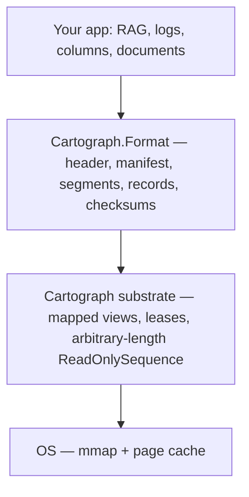
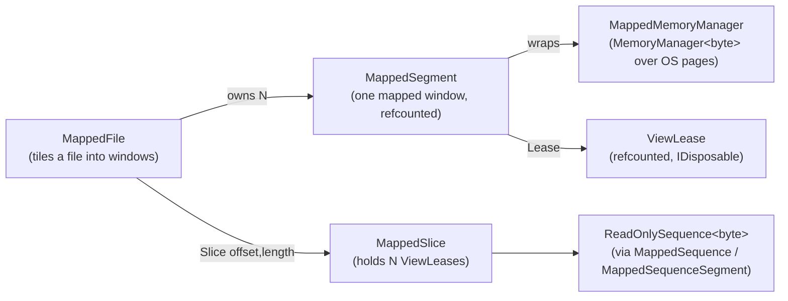
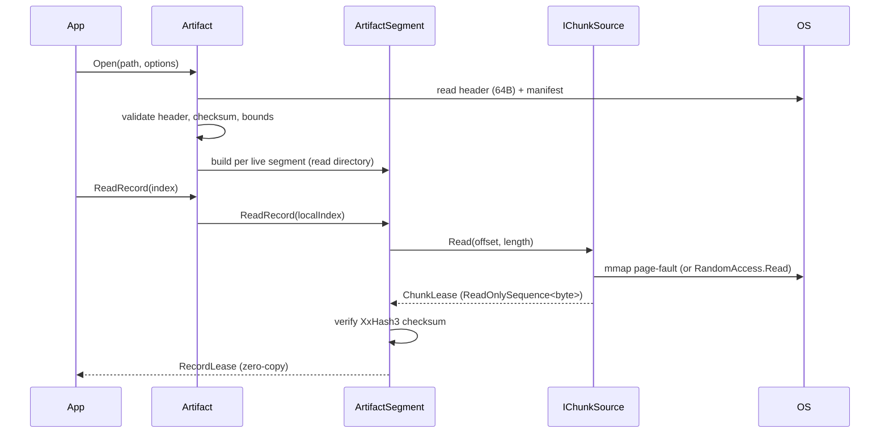

# Cartograph

**Portable memory-mapped data artifacts for .NET.** Opening costs the same whether a file holds
two megabytes of data or two hundred gigabytes, memory stays flat under load, and multiple
processes mapping the same artifact share one physical copy. Records stream out as `ReadOnlySequence<byte>` with no copies onto the managed
heap — vectors, logs, columns, documents. Retrieval-augmented generation (RAG) over a corpus
larger than RAM is the first worked example, not the definition of the library.

Status: `0.1.0-alpha`, experimental, on-disk format not yet stable. Repo:
[github.com/angelhernandezm/Cartograph](https://github.com/angelhernandezm/Cartograph). License:
MIT.

---

## 1. Rationale

The project started from a concrete pain point: streaming large PDFs/documents for RAG in .NET
fragments the managed heap and, under a container memory limit (Azure Functions, AKS, Container
Apps), can turn into a hard `OutOfMemoryException` or an OS/cgroup OOM-kill.

The insight that drives the design is a distinction between two kinds of memory, not just "using
less" of it:

| | Managed heap | Memory-mapped file pages |
|---|---|---|
| Under memory pressure | The GC can't release it back to the OS | The kernel evicts clean pages and re-faults them later |
| Failure mode at the limit | **Fatal** — `OutOfMemoryException` or OOM-kill | **Degraded** — slower, not fatal |

Managed heap pages are unreclaimable: the CLR owns them, and when a container hits its memory
limit the OS's only remaining move is to kill the process. Clean, file-backed mapped pages are
*reclaimable page cache* — the kernel can simply drop them and re-read on next touch. Same
nominal data, same footprint, completely different behavior at the limit. Converting a hard OOM
into graceful degradation is the central, defensible claim of the project.

A secondary, sharper framing of the LOH problem emerged during design: a typical 1536-dim
`float32` embedding is only ~6 KB, well under the 85 KB Large Object Heap threshold, so "LOH
fragmentation" is not actually the RAG-specific failure mode. The real fragmentation/allocation
pain comes from whole documents, decoded strings, and serialization/batch churn during ingestion
— not from the vectors themselves. Cartograph's honest claim is **zero steady-state managed
allocation** (proportional to payload size), and it controls total GC-visible working set and
bulk-buffer churn, not "the LOH" specifically.

### Why build a substrate, not a vector database

Before writing code, the idea was checked against prior art. The findings that shaped the final
scope:

- `dotnet/runtime` already contains an internal, private `MemoryMappedFileMemoryManager :
  MemoryManager<byte>` — capped at `int.MaxValue`, single-view, never made public. IKVM
  independently reimplemented the same pattern privately. That's strong validating evidence for
  the *primitive* (three different projects needed it and rewrote it). Two long-open
  dotnet/runtime issues make the same case from the outside: #24805 (2018) asked how to wrap a
  file larger than 2 GB in `Memory<T>` and got `int.MaxValue` as the answer, and #57330 (2021,
  still open) asks the CLR for help making use-after-dispose on a mapped region *detectable*
  rather than undefined — precisely the hazard `ViewLease` exists to contain. Together they are a
  door in for an eventual API proposal.
- mmap + SIMD + on-disk approximate nearest neighbor (ANN) search is **already thoroughly solved**
  natively: Faiss (`IO_FLAG_MMAP`), DiskANN (and Microsoft's own DiskANN3 research asset,
  productized in Cosmos DB), Milvus mmap mode, LanceDB, USearch (has C# bindings). Microsoft's own
  `dotnet/extensions` AI templates already ship a local vector store via
  `CommunityToolkit.VectorData.SqliteVec`. Building another local vector database duplicates both
  the open-source ecosystem and an internal Microsoft asset — a losing position.
- What's **genuinely missing**: a polished, lifetime-safe, public package exposing arbitrary-length
  mapped files as leased `ReadOnlySequence<byte>` windows, with safe remapping under concurrent
  readers and crash consistency. Nobody has shipped that for .NET.

The resulting scope decision: **build the substrate (Layer 0/1), not the vector store.** A vector
connector is included only as a labeled *demonstration* of the substrate, explicitly out of
competition with Faiss/USearch/DiskANN. The closest .NET precedent for this kind of scope is
`System.IO.Pipelines`, which started inside Kestrel and became a BCL abstraction because it turned
pooled, segmented, allocation-sensitive I/O into something reusable — not because it tried to be
an HTTP server.

### The reframe: the file *is* the format

The strongest version of the idea isn't just "stream data efficiently" — it's that a Cartograph
artifact needs no load step at all. Opening a file means `mmap` + header validation, so **open
cost is independent of how much data the file contains**: no payload is deserialized up front,
only mapped. The shorthand for this is "O(1) open," and it needs one qualification to be exact —
opening also reads each live segment's record directory, 24 bytes per record, so the cost is
constant in *payload size* and linear in *record count*. A 200 GB artifact of large records opens
as fast as a 2 MB one; a 200 GB artifact of a hundred million tiny records has a 2.4 GB directory
to read and parse, and does not. Payload size is usually imposed on you; record granularity is a
design variable you control. This is the zero-copy-deserialization idea (as used by
FlatBuffers, Cap'n Proto, Arrow, Lucene, Tantivy, LanceDB) applied at the file-format level, and
it directly strengthens the Azure Functions cold-start story: bake or cache the artifact once,
and every subsequent cold start maps it instantly instead of rehydrating it from a data store.

---

## 2. How it works

### 2.1 The core primitive: `Memory<byte>` over OS pages, not the GC heap

.NET's `MemoryManager<T>` lets you hand out `Memory<T>`/`Span<T>` backed by memory the GC doesn't
own. Cartograph's `MappedMemoryManager` wraps a `SafeMemoryMappedViewHandle` from a
`MemoryMappedViewAccessor`, acquires its pointer once, and exposes it as a `Memory<byte>`. There
are two lifetime-safety details that are easy to get wrong and that Cartograph handles explicitly:

- **`PointerOffset` re-basing.** The OS aligns a mapped view's base pointer down to the allocation
  granularity (64 KiB on Windows, 4 KiB elsewhere), not to the caller's requested offset. The
  residual is reported as `MemoryMappedViewAccessor.PointerOffset` and must be added back to the
  acquired base pointer to reach the byte the caller actually asked for. Skipping this is a classic,
  *silent* data-corruption bug (you get real memory, just from the wrong address) rather than a
  crash — so it's easy to ship undetected. `MappedMemoryManager` does this addition, once, in its
  constructor.
- **Unmap-while-live is a segfault, not an exception.** Disposing the underlying view while a
  `Span<byte>` still points into it doesn't throw — it's undefined behavior, typically an access
  violation. This is why every mapped region in the substrate is only ever handed out through a
  ref-counted **lease**, never a bare pointer or span with an independent lifetime.

### 2.2 Ref-counted leases: `ViewLease` and `MappedSegment`

`MappedSegment` represents one mapped window (at most `int.MaxValue` bytes, because
`Span<T>`/`Memory<T>` lengths are `int`). It starts with an owner reference count of 1.
`MappedSegment.Lease()` acquires an additional reference via a compare-and-swap loop:

```csharp
while (true)
{
    int current = Volatile.Read(ref _refCount);
    if (current <= 0)
        throw new ObjectDisposedException(nameof(MappedSegment)); // no resurrection

    if (Interlocked.CompareExchange(ref _refCount, current + 1, current) == current)
        return new ViewLease(this, _memory);
}
```

This CAS loop is deliberate: a naive `Interlocked.Increment` would let a lease be acquired *after*
the segment has already started unmapping (a "refcount resurrection" bug). Rejecting once
`current <= 0` closes that window.

The owner's reference and lease references are tracked the same way but released independently:
`Dispose()` releases the *owner* reference; the view is only actually unmapped
(`ReleasePointer` + `accessor.Dispose()`) once the count reaches zero. This means a reader holding
a live `ViewLease` can safely keep reading even after the artifact-level owner has disposed the
segment — the exact semantics needed so that a manifest swap (see §2.4) can retire a segment out
from under readers who are still mid-read on it, à la Lucene's `MMapDirectory` / Tantivy's
immutable segments.

`ViewLease` itself is the outward-facing safety net: double-dispose is idempotent
(`Interlocked.Exchange`-guarded), and any access to `.Memory`/`.Span` after disposal throws
`ObjectDisposedException` instead of silently reading freed memory.

### 2.3 Beyond 2 GiB: `MappedSequence` and window tiling

`Span<T>`/`Memory<T>` lengths are `int`, so a *single* mapped window tops out at ~2 GiB. Cartograph
doesn't fight that limit — it tiles. `MappedFile` divides a file into fixed-size windows (default
256 MiB, a multiple of the allocation granularity) and maps each one as its own `MappedSegment`.
`MappedFile.Slice(offset, length)` figures out which windows a requested byte range touches,
leases each one, and stitches the resulting `ReadOnlyMemory<byte>` chunks into a single logical
`ReadOnlySequence<byte>` via `MappedSequence`/`MappedSequenceSegment` (a linked list of
`ReadOnlySequenceSegment<byte>` nodes with running byte offsets). The `ReadOnlySequence<byte>`
returned has a `long` length and `SequencePosition`-based addressing, so the *logical* view is
fully 64-bit — only the individual windows underneath are capped. A record that happens to
straddle a window boundary comes back as a multi-segment sequence; a caller that needs a
contiguous `Span<float>` (e.g. for `MemoryMarshal.Cast`) can check `IsSingleSegment` first.

The on-disk artifact format itself has no size ceiling at all: every offset/length field in the
header and segment descriptors is a `ulong`, so terabyte-scale artifacts are representable; the
2 GiB constraint only ever shows up as a *runtime* tiling detail, never in the file layout.

### 2.4 Pluggable reads: `IChunkSource`

Mmap isn't strictly better than plain reads — it wins on random access over a hot page cache, but
page faults are **synchronous and blocking** (no genuine async path — a stalled fault stalls
whatever thread touched the page, which is dangerous on a thread-pool thread) and mapping a file on
Windows takes a file lock, which complicates deletion/compaction. `RandomAccess.Read` into pooled
buffers is async-friendly and often wins on large sequential scans, at the cost of a bounded copy
into managed memory.

Rather than pick one, Cartograph abstracts the read strategy behind `IChunkSource`, with two
shipped implementations selectable per `Artifact.Open` call:

- **`MappedChunkSource`** — zero-copy, backed by `MappedFile`/`MappedSegment`/`MappedSequence`.
- **`RandomAccessChunkSource`** — rents an `ArrayPool<byte>` buffer, fills it via
  `RandomAccess.Read`/`ReadAsync`, and returns it as a single-segment sequence; the pooled buffer is
  returned to the pool on `Dispose`.

Both return the same `ChunkLease` shape, so callers can swap strategies without touching anything
downstream — a deliberate design decision so the two can be benchmarked head-to-head per workload
rather than asserted about in the abstract.

`IChunkSource` is also a **public extension point**, not just an internal switch: `Artifact.Open` and
`Artifact.OpenAsync` each have an overload taking a caller-supplied `IChunkSource` plus an
`ownsSource` flag controlling whether the artifact disposes it. That makes the backing store
pluggable — HTTP range requests, object storage, an encrypted or decompressing wrapper — while the
format layer above is unchanged, because it only ever asks for "bytes at offset, this many." The
async overload awaits `IChunkSource.ReadAsync` throughout, so a genuinely remote source imposes no
blocking wait on open. Custom sources must satisfy the contract documented on `IChunkSource`;
structural validation of whatever they return still happens in the format layer, so a misbehaving
source produces a `CartographFormatException` rather than an out-of-bounds read.

### 2.5 The artifact file format

The format layer (`Cartograph.Format`) is what makes "save it, reload it later, and trust what you
read" work. Key properties:

- **Relative offsets only, never pointers.** A mapped file's base address differs on every open, so
  any persisted absolute pointer would be a guaranteed crash on reload. Every offset in the format
  is measured from the start of the file and re-based against the live mapping on access.
- **Fixed 64-byte header**, magic `"CTGH"`, an explicit little-endian marker (`0x01020304`) so a
  file written with the wrong endianness is rejected rather than silently misread, a major/minor
  version, and an XxHash3 checksum over everything before the checksum field. `ArtifactHeader.Read`
  validates all of this and throws `CartographFormatException` — never reads garbage.
- **Append-only, immutable segments + an atomic manifest.** A `SegmentedArtifactWriter` lays out one
  or more segments, each with a record directory (offset/length/checksum triples, 24 bytes each) and
  the record payloads, then writes a manifest (magic `"CTMF"`) listing every segment and which are
  live. The manifest is written *last*; a reader that observes a given manifest is guaranteed to see
  a fully-written, self-consistent set of segments. This gives crash consistency without a
  write-ahead log, modeled directly on Lucene's `MMapDirectory` and Tantivy's segment design.
- **Either region order within a segment — directory-first or payload-first.** A record's checksum
  lives in the directory, so writing the directory first forces a streamed record to be read twice
  (once to hash, once to emit). Segments containing streamed records are therefore laid out
  *payload-first*, letting a single pass hash and write simultaneously. `DirectoryOffset` and
  `PayloadOffset` are independent descriptor fields, so readers follow them rather than assuming an
  order; validation accepts either arrangement and only rejects overlap. (Consequence: a
  payload-first artifact will not open on a pre-streaming Cartograph build, which required
  directory-then-payload. Acceptable at `0.1.0-alpha`, where the on-disk format is explicitly not
  yet stable.)
- **Explicit 64-byte alignment** for segment regions, record directories, and record payloads, so
  that `MemoryMarshal.Cast<byte, float>` (needs 4-byte alignment) and SIMD loads (prefer 32/64-byte
  alignment) are always legal directly against mapped pages — no copy required to get an aligned
  `Span<float>`.
- **Per-record XxHash3 checksums plus bounds validation of every offset** against its segment and
  the file length. `Artifact.Open` and `ArtifactSegment.ReadRecord` both validate before trusting an
  offset; a truncated or corrupted file produces a clean `CartographFormatException`, never an
  out-of-bounds read. The file is treated as a trust boundary, not as pre-validated input.

### 2.6 Opening and reading

`Artifact.Open(path, options)` reads only the fixed header and the (small) manifest up front — both
bounds- and checksum-validated — then, for each live segment, reads just its record directory
(offset/length/checksum per record) through the chosen `IChunkSource`. No record *payload* is
touched until `ReadRecord`/`ReadRecordAsync` is called on it, and a mapped payload never copies
onto the managed heap. `ArtifactSegment.ReadRecord` re-verifies the record's checksum against the
directory entry by default (`ArtifactOpenOptions.VerifyChecksums`, on by default) before handing
back a `RecordLease` wrapping the `ReadOnlySequence<byte>`.

### 2.7 Writing artifacts larger than memory

The read path was always memory-bounded; the write path originally was not, because `SegmentBuilder`
copied every record into a `List<byte[]>` and held it until `Save`. Packing an *N*-gigabyte tree
therefore needed *N* gigabytes of RAM. That is now fixed, and the fix needed no format change at
all — because **layout only ever needs record *lengths*, never their bytes**. Offsets and padding can
be computed from a size table alone, so the payload can be streamed in exactly once at write time.

Records are now held as a `RecordSource` abstraction rather than a byte array:

- `BufferedRecordSource` — the in-memory case (`AddRecord`), which caches its checksum since the
  bytes are already resident.
- `FileRecordSource` — a path plus an offset/length window (`AddFileRecord`), which never
  materializes the file. It streams through a pooled 1 MiB `ArrayPool<byte>` buffer via
  `RandomAccess.Read` with `FileOptions.SequentialScan`, hashing and writing in the same pass.

Two consequences worth stating plainly. First, **bytes are read at `Save`, not when the record is
added** — a source file that is locked, deleted, or still being appended to between scan and save
fails at `Save` rather than silently producing a corrupt artifact. Second, a record is still capped
at `ArtifactFormat.MaxRecordLength` (`int.MaxValue`, ~2 GiB) — a *read-path* limit, since a record
surfaces as one `ChunkLease` from `IChunkSource.Read(long offset, int length)`, whose length
parameter is `int`. Files larger than that are split across several records ("pieces") by the caller;
the harness does this with `--piece-size`. The artifact itself has no size ceiling.

Measured: a 514 MiB tree packed with 4 MiB pieces (132 records) held a **30.6 MiB peak working
set**, and every extracted file matched its source SHA256 — including a 300 MB file spread over 75
records and a 0-byte file. (One manual run, not CI.)

### 2.8 Writing without knowing a record's length: `StreamingArtifactWriter`

§2.7 rests on the observation that layout needs record *lengths*, known up front. That is true of
`SegmentedArtifactWriter`, and it is a real constraint: `AddFileRecord` must be able to stat the
file. `StreamingArtifactWriter` removes even that requirement.

It writes each payload to the destination at the moment it is appended and never holds it
afterwards, always emitting **payload-first**. Because the record directory is written when the
segment closes, a record's length and checksum are both known by the time they are needed — so the
writer can accept a record whose length nobody knows in advance, straight from a `Stream`:

```csharp
using StreamingArtifactWriter writer = new("corpus.ctg");
using (StreamingSegment segment = writer.BeginSegment())
{
    segment.AppendRecord(bytes);                   // a span already in hand
    segment.AppendRecord(stream);                  // length discovered while writing
    await segment.AppendRecordAsync(stream);       // same, asynchronously
    segment.AppendRecord(w => Serialize(w));       // write into an IBufferWriter<byte>
}

writer.Complete();                                 // writes the manifest, patches the header
```

Steady-state cost is one pooled staging buffer plus 24 bytes of directory state per record in the
open segment, so ingesting an artifact of arbitrary size costs a bounded, constant amount of
managed memory and no payload-sized array is ever allocated. Because the writer emits sequentially,
one segment is open at a time; disposing a `StreamingSegment` completes and publishes it.

Three properties are worth stating because they are deliberate rather than incidental. The
destination must be **seekable**, since `Complete()` rewrites the reserved header in place. A writer
disposed **without** `Complete()` abandons the open segment and leaves a zeroed placeholder header —
the file is deliberately *not* a valid artifact, so a crashed ingest can never be mistaken for a
finished one. And the output is **byte-for-byte compatible** with `SegmentedArtifactWriter`, read by
`Artifact` with no format change at all.

The practical division: use `SegmentedArtifactWriter` when you are packing files you can measure,
and `StreamingArtifactWriter` when bytes arrive from somewhere that cannot tell you how many there
will be — a network stream, a compressor, a serializer writing into an `IBufferWriter<byte>`.

---

## 3. Claims

These are the specific, checkable claims the project makes about itself (from the README and
design notes), each with the mechanism that backs it:

1. **Open cost independent of payload size.** Opening reads a fixed 64-byte header, a small
   manifest, and each live segment's record directory (24 bytes per record) — never the payload. So
   open is constant in payload size and linear in record count; see §2.3's note on the distinction.
   The `OpenTimeBenchmarks` suite is built to show a *flat* open-time curve across 8/64/256 MiB
   files against a linear `Baseline_ReadAllBytes`, and `Cartograph.Baseline`'s measured A/B run
   confirms the shape: `baseline-naive` needs **421.9 ms and a 629 MiB managed allocation** to open
   a 600 MiB container, against **17.6 ms and 8.5 KB** for the mapped reader.

   One caveat matters more than the win, and the baseline harness states it plainly: **a hand-rolled
   index-only reader also opens in constant time, and opens faster.** `baseline-naive-stream` opens
   the same tree in **7.7 ms** versus the mapped reader's 17.6 ms, because it reads a small index and
   stops while `Artifact.Open` additionally parses a header, a manifest and a per-record directory
   and validates every offset. Constant-time open is not the moat — any careful developer reaches it
   in an afternoon. See `harnesses/Cartograph.Baseline/README.md` for the full tables.
2. **Flat memory / graceful degradation under memory pressure — argued, not yet demonstrated.**
   Because payload pages are clean, file-backed, mapped memory, the OS can reclaim them under
   pressure and re-fault later instead of the process hitting `OutOfMemoryException` or getting
   OOM-killed. This is the project's central claim and it rests on documented OS behaviour, but
   **no test in this repository runs a scan under a hard memory limit and shows it happening**.
   Until one does it should be read as a well-founded argument rather than a result. See the gap
   list below.
3. **Cross-process page sharing — now observable.** Multiple processes mapping the same read-only
   artifact share one physical copy of its pages through the OS page cache: an OS-level property of
   `mmap`, not something Cartograph implements itself, but one the format is designed to make useful
   (immutable, read-only artifacts). The sample explorers demonstrate it directly. Both ship without
   a single-instance guard, and `InstancePresence` publishes a per-process heartbeat so each window
   lists its live peers and its own mapped bytes — the sharing can be watched rather than taken on
   trust.
4. **Zero-copy record access.** Records stream out as `ReadOnlySequence<byte>` with no copy onto the
   managed heap under the mapped chunk source; `RecordLease.FirstSpan` /
   `MemoryMarshal.Cast<byte, float>` let SIMD code operate directly on mapped pages.
5. **Zero *steady-state* managed allocation** (explicitly not "zero allocation" — the memory
   manager, sequence segments, and leases are themselves small managed objects). What this actually
   buys: allocation is no longer proportional to *payload* size, which is what eliminates the
   ingestion-time GC churn/fragmentation that motivated the project.
6. **Works beyond the 2 GiB single-mapping ceiling.** The on-disk format uses `ulong` offsets/lengths
   throughout; at runtime, `MappedFile` tiles a large file into windows and `MappedSequence` stitches
   them into one logical `ReadOnlySequence<byte>` with `long`/`SequencePosition` addressing. The one
   surviving `int` limit is **per record**, not per artifact: `ArtifactFormat.MaxRecordLength`
   (`int.MaxValue`) exists because a record is handed back as a single `ChunkLease` from
   `IChunkSource.Read(long, int)`. Larger payloads are split into multiple records by the caller.
7. **Malformed input fails safely.** Every offset read from a file is bounds-checked before use, and
   every record is checksummed; corruption or truncation raises `CartographFormatException`, never
   an out-of-bounds read or an access violation — verified by `CorruptionTests` and
   `HeaderValidationTests`.
8. **Not an LOH-fragmentation fix, specifically.** The project explicitly walks back an earlier,
   overstated framing: a ~6 KB embedding never reaches the 85 KB LOH threshold, so the value
   proposition is working-set control and reduced bulk-buffer churn, not "fixing the LOH."
9. **Artifacts larger than RAM can be *written*, not just read.** `SegmentBuilder.AddFileRecord`
   registers a file (or a window of one) by length only; the bytes are streamed through a pooled
   1 MiB buffer at `Save`, hashing and writing in one pass. Verified at 514 MiB with a 30.6 MiB peak
   working set and a byte-exact SHA256 round trip.
10. **The backing store is pluggable.** `Artifact.Open`/`OpenAsync` accept a caller-supplied
    `IChunkSource`, so an artifact can be served from HTTP range requests, object storage, or an
    encrypted wrapper without touching the format layer — covered by `CustomChunkSourceTests`.

### Known, explicitly acknowledged gaps (not yet true)

- ~~**The writer buffers every record in managed memory.**~~ **Fixed.** `SegmentBuilder` now holds
  `RecordSource` objects rather than `byte[]`, and `AddFileRecord` streams a file's bytes through a
  pooled 1 MiB buffer at `Save` time. Building an artifact larger than RAM — the natural complement
  to reading one larger than RAM — now works. See §2.7.
- **The central claim has no test.** "Converting a hard OOM into graceful degradation" is stated
  in §1 as the project's central, defensible claim, and nothing in the suite or the harnesses
  exercises it. No test runs under a cgroup or job-object memory limit; none compares a managed
  baseline being OOM-killed against a mapped path merely slowing down. The reasoning is sound and
  rests on documented OS behaviour, but the repository's evidence is currently strongest for its
  least distinctive claims (round-tripping, safe failure on malformed input) and absent for its
  most distinctive one. Closing this is the highest-value outstanding work: a container with a hard
  limit well below the artifact size, a full scan through both `Cartograph.Baseline`'s `naive` mode
  and Cartograph's mapped source, and the exit code and peak RSS of each.
- **No *BenchmarkDotNet* output is committed**, so the `bench/` suite's open-time curve is a claim
  it can measure rather than a published result. The A/B numbers that do exist — and they are
  thorough — live in `harnesses/Cartograph.Baseline/README.md`, which is not linked from the
  headline claims above and should be.
- **A minor resource-leak nit**: if `MappedMemoryManager`'s constructor throws inside
  `MappedSegment`'s constructor, the already-created `_accessor` is not disposed. Still present
  (`MappedSegment.cs`, the `_accessor = …` / `_manager = new …` pair is not wrapped in a `try`).
  Flagged as a known, low-priority issue.
- **No *automated* test exercises a multi-gigabyte file.** `SegmentedSequenceTests` proves the
  window-stitching *mechanism* (forcing a 200 KB record across the smallest windows the OS will
  grant — the tests request `WindowSize = 1` and `MappedFile.OpenRead` rounds it up to the
  allocation granularity, 64 KiB on Windows), and
  `StreamingRecordTests` proves the streaming write path, but both stay small enough for CI. The
  largest verified round trip is a manual 514 MiB run; a true multi-GB round trip remains unproven in
  the suite.
- **32-bit processes cannot use this at all** — virtual address space runs out well before mapping
  2 GiB, let alone more. The library is 64-bit only, undocumented as a hard requirement (worth
  stating explicitly).

---

## 4. Use cases

Cartograph is a general-purpose **substrate for streaming arbitrarily large, immutable files
without a load step**, not a domain-specific tool. RAG is the first worked demo; the design is
explicitly meant to generalize:

- **Offline / edge RAG.** Compute embeddings once on a large machine, ship the resulting `.ctg`
  artifact to a resource-constrained client (desktop, edge device, NativeAOT app) that only ever
  maps and reads it — no ingestion pipeline needed on the device.
- **Fast cold starts in serverless / containers.** Bake or cache an artifact once; every subsequent
  cold start maps it — paying only for metadata — instead of re-deserializing or re-fetching a
  data store — a
  direct answer to the Azure Functions cold-start/OOM story that motivated the project.
- **Multi-process / multi-worker fan-out.** N worker processes mapping the same read-only artifact
  share one physical copy in the OS page cache, instead of N independent managed-heap copies.
- **Log or event indexes** where records are appended once, read many times, and the file is larger
  than comfortably fits in RAM.
- **Columnar or document caches** — any workload where "open a file and start reading records" needs
  to be independent of how much data the file holds, and where records are opaque byte payloads whose meaning is
  defined by the caller, not by Cartograph.
- **A benchmarking harness for comparing mmap vs. pooled `RandomAccess`** on a given access pattern
  before committing to one, via the shared `IChunkSource` abstraction.

Explicitly **not** a use case (see README "Non-goals"): an ANN/vector-index engine (no HNSW, no
IVF — use Faiss/USearch/sqlite-vec), a database (no query engine, transactions, or secondary
indexes), or a serialization framework (records are opaque bytes; the caller defines their
meaning).

---

## 5. Example code

### 5.1 Writing an artifact

```csharp
using System.Runtime.InteropServices;
using Cartograph.Format;

var writer = new SegmentedArtifactWriter();
var segment = writer.AddSegment();

float[] embedding = GetEmbedding();               // e.g. 768 dims
segment.AddRecord(MemoryMarshal.AsBytes<float>(embedding));
segment.AddRecord("a log line, a column chunk, a document…"u8);

writer.Save("corpus.ctg");
```

### 5.2 Opening and reading (zero-copy, mapped)

```csharp
using System.Runtime.InteropServices;
using Cartograph.Format;

using Artifact artifact = Artifact.Open("corpus.ctg");   // mmap + validate, no payload read

ArtifactSegment records = artifact.Segments[0];
for (int i = 0; i < records.RecordCount; i++)
{
    using RecordLease record = records.ReadRecord(i);    // zero-copy, checksum-verified
    ReadOnlySequence<byte> bytes = record.Sequence;

    // Vectors: cast mapped pages to floats in place (no heap copy).
    if (record.IsSingleSegment)
    {
        ReadOnlySpan<float> vec = MemoryMarshal.Cast<byte, float>(record.FirstSpan);
        // … TensorPrimitives.CosineSimilarity(vec, query) …
    }
}
```

### 5.3 Swapping the read strategy

```csharp
// Pooled RandomAccess reads instead of mmap (async-friendly, good for large sequential scans):
using var artifact = Artifact.Open("corpus.ctg",
    new ArtifactOpenOptions { ChunkSource = ChunkSourceKind.RandomAccess });
```

### 5.4 Forcing multi-window stitching (small windows), for tests/diagnostics

```csharp
using var artifact = Artifact.Open("corpus.ctg",
    new ArtifactOpenOptions { ChunkSource = ChunkSourceKind.Mapped, WindowSize = 1 });

using RecordLease lease = artifact.ReadRecord(0);
if (!lease.IsSingleSegment)
{
    // Record spans multiple mapped windows; walk segment-by-segment.
    foreach (ReadOnlyMemory<byte> chunk in lease.Sequence)
    {
        // ...
    }
}
```

### 5.5 Using the substrate directly, without the artifact format

```csharp
using Cartograph;

using MappedFile file = MappedFile.OpenRead("big.bin"); // O(1): mapped, no read yet
using MappedSlice slice = file.Slice(offset: 1_000_000, length: 4096);
ReadOnlySequence<byte> bytes = slice.Sequence;           // zero-copy, valid until slice.Dispose()
```

### 5.6 Writing an artifact larger than memory

```csharp
using Cartograph.Format;

var writer = new SegmentedArtifactWriter();
var segment = writer.AddSegment();

// Registered by length only — no bytes are read here.
segment.AddFileRecord(@"D:\corpus\huge1.txt");

// A file past the ~2 GiB per-record cap is added as several windows ("pieces").
long pieceSize = 256L * 1024 * 1024;
var info = new FileInfo(@"D:\corpus\enormous.bin");
for (long off = 0; off < info.Length; off += pieceSize)
    segment.AddFileRecord(info.FullName, off, Math.Min(pieceSize, info.Length - off));

// Bytes are streamed through a pooled 1 MiB buffer here, hashed and written in one pass.
writer.Save("corpus.ctg");
```

---

## 6. Architecture



Layer 0/1 (the `Cartograph` package) is the reusable, format-agnostic substrate: it knows about
mapped views, leases, and stitched byte sequences, and nothing about records, vectors, or RAG.
Layer 2 (`Cartograph.Format`) builds the artifact file format — header, manifest, segments, record
directory, checksums — entirely on top of Layer 0/1's `IChunkSource`/`ReadOnlySequence<byte>`
primitives. `Cartograph.Catalog` sits between them and the application as a thin Layer 2.5, adding
file identity — paths, timestamps, record spans — that the format deliberately omits. Anything the
caller builds (a RAG store, a log index, a columnar cache) is Layer 3 and
never needs to know whether its bytes came from a mapped view or a pooled buffer.

### Object/lifetime relationships (substrate layer)



### Read-path call flow (format layer)



---

## 7. File-format layout (on disk)

```
+-------------------------------------------------------------+
| Header (64 bytes)                                            |
|  magic "CTGH" · version · endianness marker · pointer size   |
|  ManifestOffset (u64) · ManifestLength (u64) · ContentLength  |
|  (reserved) · header checksum (XxHash3, u64)                 |
+-------------------------------------------------------------+
| Segment 0  (64-byte aligned)                                 |
|   Record directory: [relOffset u64][length u64][checksum u64]|
|                      x RecordCount   (24 bytes/entry)        |
|   (padding to payload alignment)                              |
|   Record payloads (each padded to 64-byte alignment)          |
+-------------------------------------------------------------+
| Segment 1 ...                                                 |
+-------------------------------------------------------------+
| Manifest (64-byte aligned)                                    |
|  magic "CTMF" · segment count · live count · (reserved)       |
|  SegmentDescriptor[] (64 bytes each):                         |
|    SegmentId, Flags, DataOffset, DataLength, RecordCount,     |
|    DirectoryOffset, PayloadOffset, Checksum (XxHash3)         |
+-------------------------------------------------------------+
```

All multi-byte integers are little-endian; every offset is file-relative (never an absolute
pointer, since a mapping's base address differs on every open). The manifest is written last, so
its presence at a valid, checksummed offset is the atomic "this artifact is complete" signal.

The diagram above shows the **directory-first** arrangement, used when every record in the segment is
already in memory. Segments containing streamed records (`AddFileRecord`) invert the two regions —
payloads first, directory after — so the writer can hash and emit each record in a single pass
instead of reading it twice. Readers never assume an order: `DirectoryOffset` and `PayloadOffset` are
independent fields in the segment descriptor, and validation checks only that the two regions stay
inside the segment and do not overlap.

---

## 8. File and project reference

```
Cartograph.sln
src/Cartograph/                  the mapped-memory substrate (Layer 0/1)
src/Cartograph.Format/           artifact format: header, manifest, segments, records
src/Cartograph.Catalog/          file catalog: pack and address a folder tree inside an artifact
samples/Cartograph.Explorer.*/   WinForms and GTK4 artifact explorers over a shared core
tests/Cartograph.Tests/          xUnit tests
bench/Cartograph.Benchmarks/     BenchmarkDotNet harness
harnesses/Cartograph.Harness/    console app: pack/inspect/extract a real folder tree
harnesses/Cartograph.Baseline/   the same app built on .NET primitives only, for A/B profiling
```

### `src/Cartograph` — substrate

| File | Responsibility |
|---|---|
| `MappedMemoryManager.cs` | `MemoryManager<byte>` over one mapped view's `SafeMemoryMappedViewHandle`; applies `PointerOffset` re-basing; `Pin`/`Unpin` are cheap no-ops since mapped memory is address-stable. |
| `ViewLease.cs` | Ref-counted, `IDisposable` lease guarding live access to a `MappedSegment`; use-after-dispose throws instead of reading freed memory. |
| `MappedSegment.cs` | One mapped window (≤ `int.MaxValue` bytes); CAS-based ref counting with separate owner/lease references so leases outlive an owner `Dispose()`. |
| `MappedFile.cs` | Opens a file read-only and tiles it into allocation-granularity-aligned `MappedSegment` windows (default 256 MiB); `Slice(offset,length)` stitches touched windows into one sequence. |
| `MappedSequence.cs` | Static helper: builds a `ReadOnlySequence<byte>` by chaining `MappedSequenceSegment` nodes over a list of memory chunks. |
| `MappedSequenceSegment.cs` | `ReadOnlySequenceSegment<byte>` node with running byte index; the chaining primitive that lets files > 2 GiB appear as one logical sequence. |
| `MappedSlice.cs` | Disposable view over a `MappedFile` sub-range; holds one `ViewLease` per touched window and exposes the stitched `ReadOnlySequence<byte>`. |
| `IChunkSource.cs` | `IChunkSource` interface (`Read`/`ReadAsync` → `ChunkLease`) plus the shared `ChunkLease` type, so mapped and pooled reads present the same shape. |
| `MappedChunkSource.cs` | `IChunkSource` backed by `MappedFile`; synchronous under the hood (mapped reads have no real async path), zero-copy. |
| `RandomAccessChunkSource.cs` | `IChunkSource` backed by `System.IO.RandomAccess` into `ArrayPool<byte>` buffers; genuinely async, copies into a pooled buffer bounded by record size. |
| `Platform.cs` | `AllocationGranularity` (64 KiB on Windows via `GetSystemInfo`, page size elsewhere), `PageSize`, and `AlignUp`/`AlignDown` helpers used throughout window tiling and format layout. |
| `NativePrefetch.cs` | Optional prefaulting: `PrefetchVirtualMemory` (Windows) / `madvise(MADV_WILLNEED)` (Linux) P/Invokes to bring pages in ahead of a scan and avoid unpredictable mid-query stalls; safe no-op elsewhere. |

### `src/Cartograph.Format` — artifact format

| File | Responsibility |
|---|---|
| `ArtifactFormat.cs` | On-disk layout constants: magics (`"CTGH"`/`"CTMF"`), endianness marker, version, header/manifest/descriptor sizes, 64-byte alignment, segment-live flag, and `MaxRecordLength` (the read-path per-record cap). |
| `ArtifactHeader.cs` | Fixed 64-byte file header: `Write`/`Read` with magic, endianness, version, and XxHash3 checksum validation. |
| `SegmentDescriptor.cs` | One manifest entry per segment: id, flags, data/directory/payload offsets, record count, per-segment checksum; `ulong` throughout (no 32-bit ceiling in the format). |
| `SegmentManifest.cs` | The append-only list of `SegmentDescriptor`s plus which are live; `"CTMF"`-magic-validated read/write. |
| `SegmentedArtifactWriter.cs` / `SegmentBuilder` | Computes explicit, aligned segment layout; writes header → segment regions → manifest, hashing each segment with XxHash3 as it writes. Emits directory-first or payload-first per segment depending on whether it holds streamed records. `AddRecord` takes bytes; `AddFileRecord` takes a path (or a window of one) and streams it at `Save`. |
| `RecordSource.cs` | The abstraction that decouples layout from payload residency: exposes `Length`, `HasCheapChecksum`, `ComputeChecksum()` and `WriteTo(Stream, XxHash3)`. `BufferedRecordSource` wraps a `byte[]` and caches its checksum; `FileRecordSource` streams a file window through a pooled 1 MiB buffer via `RandomAccess.Read`, hashing and writing in one pass. This is what makes writing an artifact larger than RAM possible. |
| `StreamingArtifactWriter.cs` / `StreamingSegment.cs` | A second, forward-only writer that emits each payload as it is appended and never retains it, always payload-first. Accepts records of unknown length from a `Stream` or an `IBufferWriter<byte>` callback; `Complete()` writes the manifest and patches the reserved header, so the destination must be seekable. Output is byte-for-byte compatible with `SegmentedArtifactWriter`. See §2.8. |
| `Artifact.cs` | `Artifact.Open` — reads/validates header and manifest, bounds-checks every segment/record offset, builds `ArtifactSegment`s; `ReadRecord(globalIndex)` maps a global index to a segment; internal `HashSequence`/`RecordDirectory` helpers. |
| `ArtifactSegment.cs` | One live segment: record count/lengths, `ReadRecord`/`ReadRecordAsync` (offset lookup + checksum verification against the directory), returns a `RecordLease`. |
| `ArtifactOpenOptions.cs` | `ChunkSourceKind` (Mapped/RandomAccess), mapped window size, and `VerifyChecksums` (default `true`) knobs for `Artifact.Open`. |
| `RecordLease.cs` | Disposable, zero-copy handle to one record's `ReadOnlySequence<byte>`; exposes `IsSingleSegment`/`FirstSpan` for aligned `MemoryMarshal.Cast` reads, and `ToArray()` for an explicit copy. |
| `CartographFormatException.cs` | The single exception type raised for any format inconsistency — bad magic, bad version/endianness, checksum mismatch, or an out-of-bounds offset. The file is treated as a trust boundary: malformed input must always throw this, never corrupt memory. |

### `src/Cartograph.Catalog` — the file catalog (Layer 2.5)

`Cartograph` and `Cartograph.Format` deliberately know nothing about files: they store records, not
paths. This package adds that layer, and it is what the harness and both sample explorers build on.

| File | Responsibility |
|---|---|
| `FileCatalog.cs` | A compact, versioned directory (`CatalogVersion = 2`) of `CatalogEntry` records plus the grouping metadata (`SourceRoot`, `CreatedUtc`, `GroupingMode`, `GroupNames`, `TotalBytes`). `Serialize()`/`Deserialize(ReadOnlySequence<byte>)` move it in and out of a record — by convention the single record of segment 0, so reopening recovers the whole tree in one read. |
| `CatalogEntry.cs` | One packed file: relative path, length, timestamp, optional whole-file XxHash3, and the record span backing it (`SegmentIndex`, `RecordIndex`, `GlobalIndex`, `RecordCount`). Convenience projections for `Name`, `Directory` and `Extension`. |
| `CatalogedArtifact.cs` | Read-only facade over `Artifact` + `FileCatalog`: `Open`, `Find(relativePath)`, streaming reads via `ForEachChunk`/`CopyTo`, `ExtractTo` for reconstruction on disk, `ReadPrefix` for bounded previews, and `Verify` returning a `CatalogVerification` (expected vs. computed checksum). Files spanning several records are stitched transparently, so extraction never materializes a whole file. |

### `samples/` — the artifact explorers

Two GUI front ends over a shared, UI-agnostic engine. Their purpose is demonstrative: they make
cross-process page sharing observable rather than merely asserted.

| Project | Responsibility |
|---|---|
| `Cartograph.Explorer.Core` | All behaviour, no UI dependency. `ArtifactSession` wraps a `CatalogedArtifact` and exposes the chosen `ChunkSourceKind` and a `ProcessFootprint`; `RecordPreview` renders a bounded prefix (`DefaultPrefixBytes = 64 KiB`) classified by `PreviewKind`; `DisplayFormat` handles byte/rate/checksum formatting; `InstancePresence` publishes a heartbeat file per process and returns the live `PeerInstance` list (process id, front end, opened-at, mapped bytes), treating a heartbeat older than 20 seconds as a dead process. |
| `Cartograph.Explorer.WinForms` | Windows Forms front end; targets `net10.0-windows`, so it builds on Windows only. |
| `Cartograph.Explorer.Gtk` | GTK4 front end via GirCore, binding the system `libgtk-4.so.1` so the package carries no native payload. Cross-platform. |

Neither front end has a single-instance guard, deliberately: opening the same artifact in several
processes and comparing each window's peer list and working set is the demonstration.

### `tests/Cartograph.Tests` (68 tests, all passing)

| File | Covers |
|---|---|
| `AlignmentTests.cs` | Record/segment payloads land on the format's 64-byte alignment boundary. |
| `CatalogTests.cs` | `Cartograph.Catalog`: catalog round-tripping through `Serialize`/`Deserialize`, path lookup, multi-record file spans, extraction, and checksum verification. |
| `CorruptionTests.cs` | Truncated/corrupted artifacts raise `CartographFormatException` rather than misreading. |
| `CustomChunkSourceTests.cs` | The public `IChunkSource` extension point: `Artifact.Open(IChunkSource, …)`, `ownsSource` disposal semantics, and structural validation of what a custom source returns. |
| `HeaderValidationTests.cs` | Bad magic, wrong endianness, unsupported version, and checksum mismatches are all rejected. |
| `RoundTripTests.cs` | Write → open → read reproduces the original records byte-for-byte. |
| `SegmentedSequenceTests.cs` | `MappedSequence` stitches chunks in order; a record forced across multiple tiny mapped windows reconstructs byte-exact. |
| `StreamingArtifactWriterTests.cs` | `StreamingArtifactWriter`: round-tripping under both chunk sources, byte-for-byte layout equivalence with the batch writer, ingesting a `Stream` whose length is not known in advance, and the guard rails around segment and artifact lifetime. |
| `StreamingRecordTests.cs` | `AddFileRecord` streaming: payload-first layout, file windows, mixed buffered/streamed segments, empty-file records, and the oversized-record rejection path. |
| `TestArtifacts.cs` | Shared test helpers: deterministic byte patterns, single-segment artifact builder, temp-file cleanup. |
| `ViewLeaseTests.cs` | Lease ref-counting semantics: double-dispose is safe, use-after-dispose throws, leases survive an owner `Dispose()`. |

### `bench/Cartograph.Benchmarks` (BenchmarkDotNet, `[MemoryDiagnoser]`)

| File | Measures |
|---|---|
| `OpenTimeBenchmarks.cs` | Open time vs. file size (8/64/256 MiB). Mapped and RandomAccess opens should be **flat**; the `File.ReadAllBytes` baseline is **linear**. Treat that contrast as the floor rather than the pitch: `ReadAllBytes` is not what anyone writes for a large file, so the honest opponent is `Cartograph.Baseline`'s `naive-stream` container, where the gap is much narrower. No benchmark output is committed to the repository. |
| `ScanBenchmarks.cs` | Sequential full-scan and random record-access throughput/allocations, mapped vs. pooled RandomAccess. |
| `CosineSimilarityBenchmarks.cs` | `TensorPrimitives.CosineSimilarity` over mapped pages cast in place (`Mapped_CastInPlace`) vs. a fully materialized managed `float[]` corpus (`Managed_HeapVectors`) — a brute-force scan, explicitly *not* an ANN index, meant to show the allocation/working-set gap. |
| `BenchmarkData.cs` | Shared synthetic artifact/data generation for the benchmark suite. |
| `Program.cs` | BenchmarkDotNet entry point. |

---

## 9. Requirements and constraints

- **.NET 10 SDK**, targets `net10.0`. `Cartograph.Explorer.WinForms` targets `net10.0-windows` and
  builds on Windows only; every other project is cross-platform. The GTK explorer needs GTK4 present
  at runtime (`libgtk-4-1` on Debian/Ubuntu, `gtk4` on Fedora/Arch).
- **64-bit processes only** — mapping relies on address space a 32-bit process doesn't have enough
  of.
- **Windows and Linux** supported for prefaulting/allocation-granularity P/Invokes; other platforms
  fall back to safe no-ops / page-size-based granularity.
- On Windows, an open mapped file holds a file lock — deletion/compaction of a segment must wait
  until every lease on it (and the mapping itself) is released.
