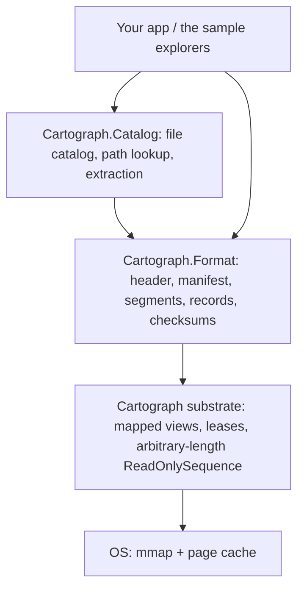

# Cartograph

Portable memory-mapped data artifacts for .NET. Opening costs the same whether a file holds two
megabytes of data or two hundred gigabytes, memory stays flat, and processes share one physical
copy. Records stream as ReadOnlySequence with no heap copies — vectors, logs, columns, documents.
RAG over corpora larger than RAM is the first demo.

---

> [!WARNING]
> **Experimental — unstable file format.** Cartograph is `0.1.0-alpha`. The on-disk format is
> versioned but **not yet stable**; artifacts written by one pre-release build may not open in the
> next. Do not use it for data you cannot regenerate.

## Build once, map instantly

The **file is the format**. Opening an artifact is `mmap` + header validation — there is no
deserialization step, so **open cost does not depend on how much data the file contains**. From
there:

- **Records without heap copies.** This is the one that matters. Records stream out as
  `ReadOnlySequence<byte>` with no copy into the managed heap, so any record type works: vectors,
  logs, columns, documents. Measured: reading and verifying a **600 MiB** tree allocates **6.9 KB**,
  against ~268 MiB for a hand-rolled flat container doing the same work.
- **Open cost independent of payload size.** You pay for the header, the manifest, and each
  segment's record directory — never the payload. A 200 GB artifact of large records opens as fast
  as a 2 MB one.
- **Flat memory.** Pages arrive on demand from the OS. A dataset larger than RAM degrades
  gracefully — clean file-backed pages are just reclaimable page cache — instead of throwing
  `OutOfMemoryException`.
- **Cross-process page sharing.** Multiple processes mapping the same read-only artifact share
  **one** physical copy through the OS page cache.

> **What is *not* the selling point:** constant-time open. A hand-rolled index-only reader also
> opens in constant time, and measurably faster than `Artifact.Open` (7.7 ms vs 17.6 ms on a 600 MiB
> container) because it reads a small index and stops, while Cartograph also parses a manifest and a
> per-record directory and validates every offset. Any careful developer reaches constant-time open
> in an afternoon. What they do not get for free is reading a record without copying it. See
> [the baseline comparison](harnesses/Cartograph.Baseline/README.md) for the full tables.

### What "open cost" precisely means

Opening reads three things: the fixed 64-byte header, the manifest, and then **each live segment's
record directory** — 24 bytes per record. Nothing else. No payload is touched.

So open is constant in *payload size* and linear in *record count*. For most workloads those are
not the same variable, and that distinction is the whole point: payload size is usually imposed on
you, while record count is a design choice you control through record granularity. A 200 GB
artifact of 800 large records opens in a handful of small reads. A 200 GB artifact of a hundred
million tiny records has a 2.4 GB directory to read and parse, and will not.

If you are sizing an artifact, that is the number to think about — not the file size.

### A note on allocation

Cartograph eliminates allocation **proportional to payload size**, not all allocation. The memory
manager, sequence segments, leases, and metadata are themselves managed objects — so the honest
claim is **zero steady-state managed allocation**. What that buys you is control over total
GC-visible working set and the bulk-buffer churn that comes from documents, decoded strings, and
serialization buffers. (It is *not* about the Large Object Heap: a 1536-dim float32 embedding is only
~6 KB and never reaches the 85 KB LOH threshold.)

The same discipline applies to *writing*: records can be streamed at `Save` rather than buffered, or
written straight through as they arrive, so packing does not scale its memory with payload size. See
[Writing artifacts larger than memory](#writing-artifacts-larger-than-memory).

## Quickstart

```csharp
using System.Buffers;
using System.Runtime.InteropServices;
using Cartograph.Format;

// --- Build once ---
var writer = new SegmentedArtifactWriter();
var segment = writer.AddSegment();

float[] embedding = GetEmbedding();               // e.g. 768 dims
segment.AddRecord(MemoryMarshal.AsBytes<float>(embedding));
segment.AddRecord("a log line, a column chunk, a document…"u8);

writer.Save("corpus.ctg");

// --- Map instantly ---
using Artifact artifact = Artifact.Open("corpus.ctg");   // mmap + validate, no payload read

ArtifactSegment records = artifact.Segments[0];
for (int i = 0; i < records.RecordCount; i++)
{
    using RecordLease record = records.ReadRecord(i);    // zero-copy, checksum-verified
    ReadOnlySequence<byte> bytes = record.Sequence;

    // Vectors: cast mapped pages to floats in place (no heap copy).
    if (record.IsSingleSegment)
    {
        ReadOnlySpan<float> vec = MemoryMarshal.Cast<byte, float>(record.FirstSpan);
        // … TensorPrimitives.CosineSimilarity(vec, query) …
    }
}
```

Swap the read strategy without touching the rest of your code:

```csharp
// Pooled RandomAccess reads instead of mmap (async-friendly, good for large sequential scans):
using var artifact = Artifact.Open("corpus.ctg",
    new ArtifactOpenOptions { ChunkSource = ChunkSourceKind.RandomAccess });
```

### Bring your own storage

`IChunkSource` is a supported extension point, so an artifact does not have to live on a local
disk. Implement it over HTTP range requests, S3 or Azure Blob, an encrypted container, or an
in-memory buffer, and hand the instance to `Artifact.Open`:

```csharp
sealed class MyChunkSource : IChunkSource
{
    public long Length => /* total artifact size, fixed for the source's lifetime */;

    public ChunkLease Read(long offset, int length)
    {
        // Fetch exactly [offset, offset + length) — short reads are a contract violation.
        // `owner` is disposed with the lease; pass null when the memory needs no cleanup.
        return new ChunkLease(sequence, owner);
    }

    public ValueTask<ChunkLease> ReadAsync(long offset, int length, CancellationToken ct = default) => /* … */;
    public void Dispose() { }
}

// ownsSource: false keeps the source alive after the artifact is disposed.
using var source = new MyChunkSource(/* … */);
using Artifact artifact = await Artifact.OpenAsync(source, ownsSource: false);
```

Opening still reads only the header, the manifest, and each segment's record directory — never the
payload. So a 200 GB artifact behind a range-capable HTTP server opens in a handful of small
requests, and records fault in on demand. Cartograph ships no transport code and takes no
dependency on any client library; the contract implementations must honour (exact-length reads,
absolute offsets, stable length, thread safety, lease lifetime) is documented on `IChunkSource`.

Structural validation and per-record checksums still apply to custom sources, so a buggy or hostile
source produces a clean `CartographFormatException` rather than silent corruption.

## Architecture

Cartograph is layered so the substrate is usable on its own and the format builds on top of it.



### `Cartograph` — the mapped-memory substrate (Layer 0/1)

Exposes arbitrary-length memory-mapped files as lifetime-safe `Memory<byte>` /
`ReadOnlySequence<byte>` with no managed copies.

- **`MappedMemoryManager`** — a `MemoryManager<byte>` over a mapped view (adds `PointerOffset` to the
  acquired base pointer; `Pin` takes no GC handle since mapped memory is address-stable).
- **`ViewLease`** — ref-counted lease guarding a view. Unmapping a view while spans are live is a
  *segfault, not an exception*; a view is unmapped only when the last lease is released, and
  use-after-dispose throws `ObjectDisposedException`.
- **`MappedSegment`** — one mapped window, aligned to the OS allocation granularity (64 KiB on
  Windows, distinct from the 4 KiB page size).
- **`MappedSequenceSegment` / `MappedSequence`** — stitch multiple windows into one
  `ReadOnlySequence<byte>`. Because `Span`/`Memory` lengths are `int`, files above ~2 GiB *require*
  multiple views; this segmented sequence is the piece that does not otherwise exist in .NET.
- **`IChunkSource`** — pluggable reads, with `MappedChunkSource` (mmap) and
  `RandomAccessChunkSource` (pooled `System.IO.RandomAccess`) shipped so the two can be benchmarked
  head-to-head. It is also a public extension point: implement it to back an artifact with any
  store — HTTP range requests, object storage, an encrypted container — and pass it to
  `Artifact.Open` / `Artifact.OpenAsync`.
- **`NativePrefetch`** — optional `PrefetchVirtualMemory` (Windows) / `madvise(MADV_WILLNEED)`
  (Linux) helpers to avoid unpredictable mid-query page-fault stalls.

### `Cartograph.Format` — the artifact format

What makes "save it and reload it later" work.

- **Header** with magic `CTGH`, version, endianness marker, and a header checksum — unrecognized
  files are refused, never read as garbage.
- **Relative offsets only.** The base address differs on every map, so absolute pointers are never
  stored.
- **Explicit alignment.** Segments, directories, and record payloads are padded to 64 bytes so
  `MemoryMarshal.Cast<byte, float>` and SIMD loads are always legal.
- **Append-only immutable segments + an atomic manifest** — writers append new segments then swap
  the manifest; readers holding leases finish on old segments before those are unmapped. This gives
  crash consistency without a WAL (modeled on Lucene's `MMapDirectory` and Tantivy's immutable
  segments).
- **Per-record checksums** (XxHash3) and **bounds validation of every offset** against segment
  length — a truncated or malformed artifact produces a clean `CartographFormatException`, never an
  out-of-bounds read.

### `Cartograph.Catalog` — packing a folder tree into an artifact

`Cartograph` and `Cartograph.Format` deliberately know nothing about files: they store records, not
paths. `Cartograph.Catalog` adds that layer.

- **`FileCatalog`** — a compact, versioned directory of `CatalogEntry` records (relative path,
  length, record span, timestamp, optional whole-file XxHash3). By convention it is written as the
  single record of segment 0, so reopening an artifact recovers the entire tree in one read.
- **`CatalogedArtifact`** — a read-only facade that opens an artifact, validates its catalog, and
  resolves a path to the records backing it. It can stream a file with `ForEachChunk`/`CopyTo`,
  reconstruct it on disk with `ExtractTo`, read a bounded `ReadPrefix` for previewing, and `Verify`
  a file against its stored checksum.

Files larger than the piece size span consecutive records, which the catalog records as a
`[GlobalIndex, GlobalIndex + RecordCount)` span, so extraction stays streaming and never
materializes a whole file in memory.

### Writing artifacts larger than memory

There are two writers, and which you want depends on whether you know a record's length up front.

**`SegmentedArtifactWriter`** — records are declared, then written at `Save`:

```csharp
SegmentedArtifactWriter writer = new();
SegmentBuilder segment = writer.AddSegment();

segment.AddRecord(bytes);                          // buffered: held on the managed heap until Save
segment.AddFileRecord(path);                       // streamed: read during Save, never buffered
segment.AddFileRecord(path, offset, length);       // streamed: one byte range of a file
```

`AddFileRecord` records only the path, offset, and length. The bytes are read during `Save` through
a single pooled 1 MiB buffer, so **packing cost is independent of total payload size** — an artifact
covering hundreds of gigabytes is written with the same steady-state memory as one covering a few
kilobytes. This works because the layout is derived from record *lengths* alone, which are known up
front.

**`StreamingArtifactWriter`** — records are written as they arrive, and lengths need not be known
at all:

```csharp
using StreamingArtifactWriter writer = new("corpus.ctg");
using (StreamingSegment segment = writer.BeginSegment())
{
    segment.AppendRecord(bytes);                   // a span you already have
    segment.AppendRecord(stream);                  // length discovered while writing
    await segment.AppendRecordAsync(stream);       // same, asynchronously
    segment.AppendRecord(w => Serialize(w));       // write directly into an IBufferWriter<byte>
}

writer.Complete();                                 // patches the header; required
```

Each payload is written to the destination the moment it is appended and never held afterwards.
Steady-state cost is one pooled staging buffer plus 24 bytes of directory state per record in the
open segment, so ingesting an artifact of arbitrary size costs a bounded, constant amount of managed
memory. Because the writer emits sequentially, **one segment is open at a time** — close it (by
disposing it, as above, or by calling `Complete()` on it) before beginning the next.

Two further constraints come with it. The destination must be **seekable**, because `Complete()` rewrites
the header in place. And a writer disposed without calling `Complete()` deliberately leaves a zeroed
placeholder header — the file is not a valid artifact, by design, so a crashed ingest cannot be
mistaken for a finished one. Output is byte-for-byte compatible with `SegmentedArtifactWriter` and
needs no format change to read.

**Segment region order.** A record's checksum lives in the segment's record directory. For buffered
records the bytes are already in hand, so the directory is written first. A streamed record has no
cheap checksum, so segments containing one are written **payload-first** — payload region, then
directory — which lets a single pass both emit and checksum every record. Reading a streamed file
twice would otherwise double the I/O. (`StreamingArtifactWriter` always writes payload-first, which
is what lets it accept a record of unknown length.) Both orders are legal: `DirectoryOffset` and
`PayloadOffset` are independent 64-bit fields in the segment descriptor, and readers follow them
rather than assuming an order. `ArtifactSegment.IsPayloadFirst` reports which layout a segment uses.

**Size limits.** Offsets and lengths are 64-bit on disk, so an artifact has no practical size cap.
A *single record* is capped at `ArtifactFormat.MaxRecordLength` (`int.MaxValue`, ~2.1 GB) because a
record is surfaced as one `ChunkLease` from `IChunkSource.Read(long offset, int length)`, whose
length is a 32-bit `int`. Inputs larger than that are split across consecutive records and presented
by the application as one logical object — see the harness for that pattern. Exceeding the cap
throws at `AddFileRecord`, not at open time.

## Non-goals

Cartograph is a substrate and a file format. It is explicitly **not**:

- **An ANN / vector-index engine.** No HNSW, no IVF. That space is well served by
  **Faiss**, **USearch**, and **sqlite-vec**; building another is out of scope.
- **A database.** No query engine, transactions, or secondary indexes.
- **A serialization framework.** Records are opaque bytes; you choose their meaning.
- **A server or transport.** Cartograph reads artifacts; it does not serve them. An artifact is an
  immutable file, so any range-capable HTTP server, object store, or CDN already serves it correctly
  — and immutability makes `ETag` / `Cache-Control: immutable` trivially safe. Remote *reading* is
  supported through a custom `IChunkSource`.

RAG over corpora larger than RAM is the first intended *demo*, not the definition of the library.

## Evidence: what is measured, and what is argued

Some of what this README claims is enforced by code and covered by tests. Some is a well-founded
argument that has not yet been demonstrated. The difference matters, so it is stated here rather
than left for you to work out.

**Enforced and tested.** Open reads only header, manifest and record directories. Zero-copy record
access under the mapped source. Correct behaviour past the 2 GiB single-window ceiling. Malformed
input raises `CartographFormatException` rather than reading out of bounds. Pluggable backing
stores. 68 tests cover these.

**True, a property of the OS — and now observable.** Cross-process page sharing is what `mmap` and
the page cache already do; what Cartograph contributes is making it useful, since artifacts are
immutable and read-only, so N processes really do share one physical copy. The sample explorers in
`samples/` make that visible rather than asserted: they ship deliberately without a single-instance
guard, and each window lists its live peers and its own working set, so you can open the same
artifact in several processes and watch the sharing happen.

**Argued, not yet demonstrated.** Graceful degradation under memory pressure — the claim that a
workload which would OOM on the managed heap merely slows down when its pages are clean and
file-backed. The reasoning rests on documented OS behaviour and every design decision here follows
from it, but **no test in this repository runs a scan under a hard memory limit and shows it**.
Until one does, treat it as a well-founded argument. Building that test is the most valuable
outstanding item.

**Measured, and committed.** `harnesses/Cartograph.Baseline/README.md` carries a full A/B run
against five plain-.NET containers on a 24.54 MiB and a 600 MiB tree — pack, open and verify times,
allocation, and peak working set. Read its conclusions before quoting anything from here; they are
deliberately unflattering where the data is unflattering. Separately, a 514 MiB tree packed with
4 MiB pieces held a 30.6 MiB peak working set with every extracted file matching its source SHA-256
(a manual run, not CI). No BenchmarkDotNet output from `bench/` is committed.

**Not covered.** No automated test exercises a multi-gigabyte file. 64-bit processes only.

## Requirements

- .NET 10 SDK (targets `net10.0`).
- 64-bit only — a 32-bit process runs out of virtual address space long before anything else.
- To run the GTK explorer on Linux, GTK4 at runtime (`libgtk-4-1` on Debian/Ubuntu, `gtk4` on
  Fedora/Arch). The Windows Forms explorer targets `net10.0-windows` and builds on Windows only;
  every other project is fully cross-platform.

## Layout

```
Cartograph.sln
src/Cartograph/                        the mapped-memory substrate (Layer 0/1)
src/Cartograph.Format/                 artifact format: header, manifest, segments, records
src/Cartograph.Catalog/                file catalog: pack and address a folder tree inside an artifact
samples/Cartograph.Explorer.Core/      UI-agnostic explorer engine shared by both front ends
samples/Cartograph.Explorer.WinForms/  Windows Forms artifact explorer
samples/Cartograph.Explorer.Gtk/       GTK4 artifact explorer for Linux
tests/Cartograph.Tests/                xUnit tests
bench/Cartograph.Benchmarks/           BenchmarkDotNet harness (see its README)
harnesses/Cartograph.Harness/          end-to-end console harness (see its README)
harnesses/Cartograph.Baseline/         the same harness built on .NET primitives only, for A/B profiling
```

## Explorers: many processes, one mapping

`samples/` contains two GUI applications that open an artifact and let you browse, preview, verify
and extract any file inside it. They exist to make Cartograph's defining property visible: **any
number of processes can open the same artifact at once, and the operating system backs every one of
those mappings with a single set of physical pages.**

Both applications are deliberately built without a single-instance guard. Press **New instance** and
another process starts on the same file; each window then lists its live peers and its own working
set, so the sharing is observable rather than merely asserted.

All behaviour lives in `Cartograph.Explorer.Core`, which has no UI dependency at all. The two front
ends differ only in how they draw.

```bash
# Windows
dotnet run --project samples/Cartograph.Explorer.WinForms -c Release -- path/to/artifact.ctg

# Linux (needs GTK4 at runtime: apt install libgtk-4-1)
dotnet run --project samples/Cartograph.Explorer.Gtk -c Release -- path/to/artifact.ctg
```

The GTK front end binds the system GTK4 libraries through GirCore, so the NuGet package carries no
native payload and the distro's `libgtk-4.so.1` is used. To run it on a machine without the .NET SDK
installed, publish it self-contained:

```bash
dotnet publish samples/Cartograph.Explorer.Gtk -c Release -r linux-x64 --self-contained
```

## Try it end to end

`harnesses/Cartograph.Harness` packs a folder tree into an artifact, closes it, reopens it from
nothing but a path, and verifies every record against the files still on disk. It needs no
arguments to do something useful:

```bash
dotnet run --project harnesses/Cartograph.Harness -c Release -- demo --list
```

Or point it at a real folder:

```bash
dotnet run --project harnesses/Cartograph.Harness -c Release -- roundtrip ./src --out src.ctg
```

Inspect an artifact's header and segment manifest without reading a single record payload:

```bash
dotnet run --project harnesses/Cartograph.Harness -c Release -- manifest src.ctg
```

It is also the shortest tour of the API: the harness writes its own catalog as record `0`, so
reopening recovers the whole directory structure in a single read and then addresses any file
directly by index.

## Compare it against plain .NET

`harnesses/Cartograph.Baseline` solves the identical problem — pack a tree, close it, reopen from a
path, prove every byte survived — using **only .NET primitives, with no reference to Cartograph at
all**. It is the control group. To keep the comparison honest the two programs share no assembly:
their metrics, demo-tree and reporting code are duplicated verbatim so neither inherits the other's
JIT or allocation behaviour.

```bash
# Cartograph
dotnet run --project harnesses/Cartograph.Harness -c Release -- demo --demo-files 2000 --csv --quiet

# The same tree, plain .NET
dotnet run --project harnesses/Cartograph.Baseline -c Release -- demo --demo-files 2000 --container naive-stream --csv --quiet
```

Both emit CSV, so the difference is attributable to the artifact format rather than to the machine.
Five container modes are available (`zip-store`, `zip-deflate`, `naive`, `naive-stream`, `loose`);
`naive-stream` — a flat file with an index at the tail, read with `RandomAccess.Read` into a reused
buffer — is the fairest hand-rolled rival and the one worth beating. See its README for what each
mode is meant to show.

## License

MIT © Angel Hernandez
