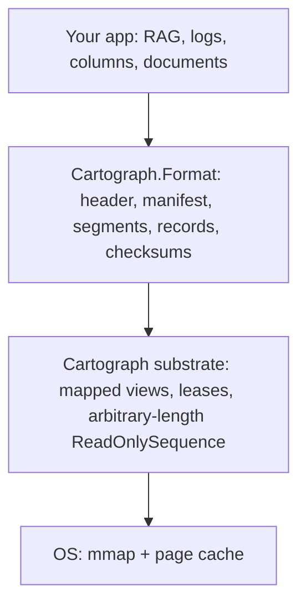

# Cartograph

Portable memory-mapped data artifacts for .NET. Opening is constant-time regardless of size, memory stays flat, and processes share one physical copy. Records stream as ReadOnlySequence with no heap copies — vectors, logs, columns, documents. RAG over corpora larger than RAM is the first demo.

---

> [!WARNING]
> **Experimental — unstable file format.** Cartograph is `0.1.0-alpha`. The on-disk format is
> versioned but **not yet stable**; artifacts written by one pre-release build may not open in the
> next. Do not use it for data you cannot regenerate.

## Build once, map instantly

The **file is the format**. Opening an artifact is `mmap` + header validation — there is no
deserialization step, so **open cost is O(1) regardless of file size**. From there:

- **Constant-time open.** You pay for the header and manifest, never the payload. A 200 GB artifact
  opens as fast as a 2 MB one.
- **Flat memory.** Pages arrive on demand from the OS. A dataset larger than RAM degrades
  gracefully — clean file-backed pages are just reclaimable page cache — instead of throwing
  `OutOfMemoryException`.
- **Cross-process page sharing.** Multiple processes mapping the same read-only artifact share
  **one** physical copy through the OS page cache.
- **Records without heap copies.** Records stream out as `ReadOnlySequence<byte>` with no copy into
  the managed heap, so any record type works: vectors, logs, columns, documents.

### A note on allocation

Cartograph eliminates allocation **proportional to payload size**, not all allocation. The memory
manager, sequence segments, leases, and metadata are themselves managed objects — so the honest
claim is **zero steady-state managed allocation**. What that buys you is control over total
GC-visible working set and the bulk-buffer churn that comes from documents, decoded strings, and
serialization buffers. (It is *not* about the Large Object Heap: a 1536-dim float32 embedding is only
~6 KB and never reaches the 85 KB LOH threshold.)

## Quickstart

```csharp
using System.Buffers;
using System.Runtime.InteropServices;
using Cartograph.Format;

// --- Build once ---
var writer = new SegmentedArtifactWriter();
var segment = writer.AddSegment();

float[] embedding = GetEmbedding();               // e.g. 768 dims
segment.AddRecord(MemoryMarshal.AsBytes<float>(embedding));
segment.AddRecord("a log line, a column chunk, a document…"u8);

writer.Save("corpus.ctg");

// --- Map instantly (constant-time open) ---
using Artifact artifact = Artifact.Open("corpus.ctg");   // mmap + validate, no payload read

ArtifactSegment records = artifact.Segments[0];
for (int i = 0; i < records.RecordCount; i++)
{
    using RecordLease record = records.ReadRecord(i);    // zero-copy, checksum-verified
    ReadOnlySequence<byte> bytes = record.Sequence;

    // Vectors: cast mapped pages to floats in place (no heap copy).
    if (record.IsSingleSegment)
    {
        ReadOnlySpan<float> vec = MemoryMarshal.Cast<byte, float>(record.FirstSpan);
        // … TensorPrimitives.CosineSimilarity(vec, query) …
    }
}
```

Swap the read strategy without touching the rest of your code:

```csharp
// Pooled RandomAccess reads instead of mmap (async-friendly, good for large sequential scans):
using var artifact = Artifact.Open("corpus.ctg",
    new ArtifactOpenOptions { ChunkSource = ChunkSourceKind.RandomAccess });
```

## Architecture

Cartograph is layered so the substrate is usable on its own and the format builds on top of it.



### `Cartograph` — the mapped-memory substrate (Layer 0/1)

Exposes arbitrary-length memory-mapped files as lifetime-safe `Memory<byte>` /
`ReadOnlySequence<byte>` with no managed copies.

- **`MappedMemoryManager`** — a `MemoryManager<byte>` over a mapped view (adds `PointerOffset` to the
  acquired base pointer; `Pin` takes no GC handle since mapped memory is address-stable).
- **`ViewLease`** — ref-counted lease guarding a view. Unmapping a view while spans are live is a
  *segfault, not an exception*; a view is unmapped only when the last lease is released, and
  use-after-dispose throws `ObjectDisposedException`.
- **`MappedSegment`** — one mapped window, aligned to the OS allocation granularity (64 KiB on
  Windows, distinct from the 4 KiB page size).
- **`MappedSequenceSegment` / `MappedSequence`** — stitch multiple windows into one
  `ReadOnlySequence<byte>`. Because `Span`/`Memory` lengths are `int`, files above ~2 GiB *require*
  multiple views; this segmented sequence is the piece that does not otherwise exist in .NET.
- **`IChunkSource`** — pluggable reads, with `MappedChunkSource` (mmap) and
  `RandomAccessChunkSource` (pooled `System.IO.RandomAccess`) shipped so the two can be benchmarked
  head-to-head.
- **`NativePrefetch`** — optional `PrefetchVirtualMemory` (Windows) / `madvise(MADV_WILLNEED)`
  (Linux) helpers to avoid unpredictable mid-query page-fault stalls.

### `Cartograph.Format` — the artifact format

What makes "save it and reload it later" work.

- **Header** with magic `CTGH`, version, endianness marker, and a header checksum — unrecognized
  files are refused, never read as garbage.
- **Relative offsets only.** The base address differs on every map, so absolute pointers are never
  stored.
- **Explicit alignment.** Segments, directories, and record payloads are padded to 64 bytes so
  `MemoryMarshal.Cast<byte, float>` and SIMD loads are always legal.
- **Append-only immutable segments + an atomic manifest** — writers append new segments then swap
  the manifest; readers holding leases finish on old segments before those are unmapped. This gives
  crash consistency without a WAL (modeled on Lucene's `MMapDirectory` and Tantivy's immutable
  segments).
- **Per-record checksums** (XxHash3) and **bounds validation of every offset** against segment
  length — a truncated or malformed artifact produces a clean `CartographFormatException`, never an
  out-of-bounds read.

## Non-goals

Cartograph is a substrate and a file format. It is explicitly **not**:

- **An ANN / vector-index engine.** No HNSW, no IVF. That space is well served by
  **Faiss**, **DiskANN**, **USearch**, and **sqlite-vec**; building another is out of scope.
- **A database.** No query engine, transactions, or secondary indexes.
- **A serialization framework.** Records are opaque bytes; you choose their meaning.

RAG over corpora larger than RAM is the first intended *demo*, not the definition of the library.

## Requirements

- .NET 10 SDK (targets `net10.0`).

## Layout

```
Cartograph.sln
src/Cartograph/               the mapped-memory substrate (Layer 0/1)
src/Cartograph.Format/        artifact format: header, manifest, segments, records
tests/Cartograph.Tests/       xUnit tests
bench/Cartograph.Benchmarks/  BenchmarkDotNet harness (see its README)
```

## License

MIT © Angel Hernandez
